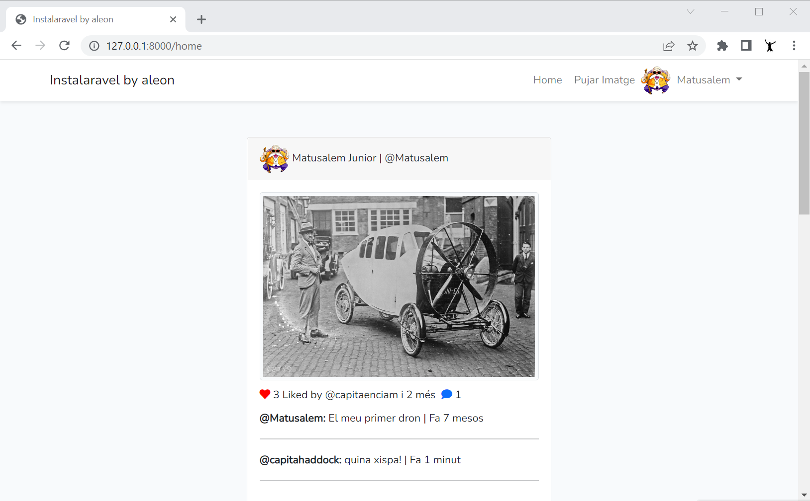

# Instalaravel

TODO

## Requeriments

🖥️ php -v
→ PHP 8.0.12 (cli)

🖥️ MySQL
→ Server version: 8.0.28 MySQL Community Server - GPL

🖥️ composer -v
→ Composer version 2.2.5

🖥️ php artisan --version
→ Laravel Framework 9.8.1

🖥️ node -v
→ v16.14.2

🖥️ npm -v
→ 8.6.0

## Get Started
- git clone https://github.com/aleongit/instalaravel.git
- cd instalaravel
- composer install
- npm install && npm run dev
- run **init.sql** in MySQL
- .env
- php artisan cache:clear
- php artisan route:cache
- php artisan config:clear
- php artisan view:clear
- or **php artisan optimize:clear**
- php artisan storage:link ('storage\app' links in 'public\' )
- php artisan serve
- http://127.0.0.1:8000/
- user: capitaenciam@gmail.com password
- user: capitahaddock@gmail.com password
- user: matusalem@gmail.com password
- or http://127.0.0.1:8000/register

